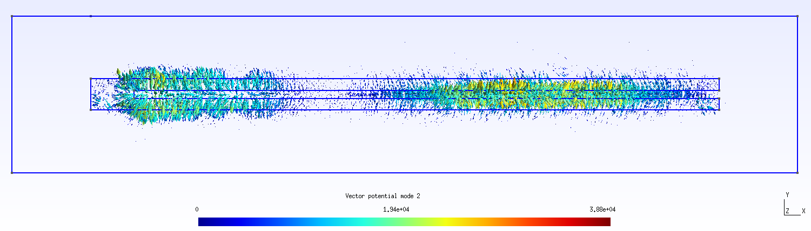

# DiscretePDEs.jl

DiscretePDEs.jl is a package for discretizing partial differential equations using [DiscreteExteriorCalculus.jl](https://github.com/rigetti/DiscreteExteriorCalculus.jl). 3D visualization and meshing is performed with [Gmsh](http://gmsh.info/). Geometrical models
can be created using the Gmsh scripting functionality or by importing a GDS file. [LayoutEditor](https://layouteditor.com/) is a convenient program for creating and manipulating GDS files.

In addition to functionality for discretizing arbitrary PDEs, DiscretePDEs.jl also has
functionality specifically for modeling electromagnetism:
  - Electrostatic fields and the capacitance matrix.
  - Magnetostatic fields and the inductance matrix, including the London equation.
  - Electrodynamic [Positive Second Order models](https://arxiv.org/abs/1810.11510)
  including Ohm's Law and the London equation, using [AdmittanceModels.jl](https://github.com/rigetti/AdmittanceModels.jl)
    - Normal modes.
    - Transfer functions.

The tests in the `test` folder also serve as in-depth examples for each of these problem
types.

## Installation

Clone the repository from GitHub. Then use the Julia package manager to `activate` and `build`.

**Notes on build**: This package has two non-Julia dependencies. One is [Gmsh](http://gmsh.info/), a 3D visualization and meshing program, and the other is [gdspy](https://github.com/heitzmann/gdspy), a Python package for manipulating GDS files. The `deps/build.jl` file configures the `gmsh` and `gdspy` dependencies and installs them if they are not present.

For `gmsh`
  - If `ENV["gmshjl"]` is set or `gmshjl=...` is in a `deps/.env` file, the `gmsh.jl` file at the indicated path is used. Precedent is given to the environment variable over the `deps/.env` entry.
  - Else if a `gmsh.jl` file can be found somewhere within `/usr/bin`, that `gmsh.jl` file is used.
  - Else `gmsh.jl` is installed using `deps/install_gmsh.sh`. This will work on Mac OSX or Linux Ubuntu:18.10.

For `gdspy`
  - If `ENV["PYTHON"]` is set or `PYTHON=...` is in the `deps/.env` file, the `python` binary at the indicated path is used. Precedent is given to the environment variable over the `.env` entry.
  - Else
    - If `which conda` fails, and `miniconda3` is not already present in the home directory, `miniconda3` is installed in the home directory. The `.bashrc` and `.bash_profile` etc. are not modified.
    - If a `DiscretePDEs` `conda` environment does not already exist, one is made using the `deps/conda_env.yml` file. The `python` from this `conda` environment is used to build `PyCall.jl`.

If this all succeeds, the paths to `gmsh.jl` and python are saved in `deps/.env` so later builds will use the same `gmsh` and `python`.

## Example usage: electromagnetic modes of a box

See `test/test_modes_box.jl` for a more complete version of this example.

Import packages.
```julia
using DiscreteExteriorCalculus, DiscretePDEs
using AdmittanceModels: lossless_modes_dense, apply_transform
using LinearAlgebra: norm
```

Create a file `box.geo` that describes a 10×12×14 box.
```julia
a, b, c = 10, 12, 14
file_name = joinpath(@__DIR__, "box.geo")
geo_write!(file_name, characteristic_length_factor=1,
    footer="""
    Box(1) = {0, 0, 0, $a, $b, $c};
    """)
```

Start gmsh, open the file, mesh the box, and create a `TriangulatedComplex` for the primal
mesh.
```julia
initialize!()
gmsh_open!(file_name)
N, K = 3, 4
mesh!(K)
node_tags, points, tcomp = get_triangulated_complex(N, K)
```

Orient the primal mesh, compute the dual mesh, and put them both into a `Mesh` object.
```julia
orient!(tcomp.complex)
m = Metric(N)
mesh = Mesh(tcomp, circumcenter(m))
```

Create a [Positive Second Order model](https://arxiv.org/abs/1810.11510) and apply the
Coulomb gauge and boundary condition constraints.
```julia
comp = tcomp.complex
μ⁻_form = get_material(comp, 1/DiscretePDEs.μ₀, 3)
Λ⁻_form = get_material(comp, 0, 2)
σ_form = get_material(comp, 0, 2)
ϵ_form = get_material(comp, DiscretePDEs.ϵ₀, 2)
pso, null_basis = electrodynamics_pso(m, mesh, Vector{Cell{N}}[], boundary(comp),
    μ⁻_form, Λ⁻_form, σ_form, ϵ_form)
constrained_pso = apply_transform(pso, null_basis)
```

Find the normal modes of the box.
```julia
λs, vs = lossless_modes_dense(constrained_pso)
freqs = imag(λs)/(2π)
```

Plot the mesh and lowest normal mode using gmsh.
```julia
vec_A = sharp(m, comp, null_basis * vs[:,1])
vec_A /= maximum(norm.(vec_A))
comp_points = [c.points[1] for c in comp.cells[1]]
ordering = [findfirst(isequal(p), comp_points) for p in points]
add_field!("Vector potential", node_tags, vec_A[ordering])
gui!()
```

Mesh: 
Lowest normal mode vector potential: 

## Example usage: modes of a λ/4 coplanar waveguide resonator

See `test/test_cpw_resonator.jl`. A non-uniform mesh with 7282 tetrahedra is used.

Mesh: 
Lowest normal mode vector potential: 
Second lowest normal mode vector potential: 
